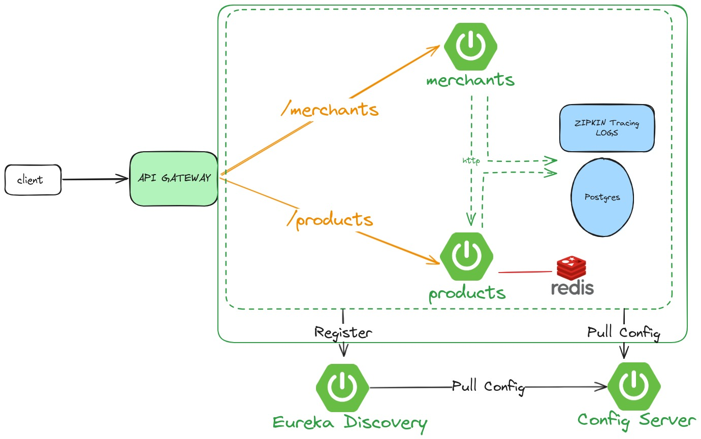

# Mini Merchant-Product Microservices Project

Proyek ini adalah implementasi sederhana dari sistem e-commerce menggunakan Java 17 dan Maven. Proyek ini mencakup beberapa teknologi dan fitur seperti Spring IoC, Java Stream, Native SQL Query, Redis Caching, dan PostgreSQL. Dokumentasi API dapat diakses melalui Swagger atau melalui Postman Collection yang tersedia di dalam folder `resources`.

## Implementasi

- **Java 17**: Versi Java yang digunakan untuk proyek ini.
- **Maven**: Manajemen dependensi dan build.
- **Spring IoC**: Menggunakan Inversion of Control untuk pengelolaan bean dan dependensi.
- **Java Stream**: Penggunaan Java Stream API untuk memproses koleksi data.
- **Native SQL Query**: Menggunakan query JDBCTemplate untuk berinteraksi dengan database.
- **Redis Caching**: Implementasi caching menggunakan Redis untuk meningkatkan performa aplikasi.
- **PostgreSQL**: Basis data relasional yang digunakan untuk menyimpan data aplikasi.
- 
## Prasyarat

Sebelum menjalankan proyek ini, pastikan Anda telah menginstal:

- DOCKER
- Java 17
- Maven

## Instalasi dan Konfigurasi
1. **Clone repository:**
   ```bash
   git clone <repository-url>
   cd mini-ecommerce
    ```
2. **Masuk ke Direktori Project:**

properties
Copy code
```
cd ptdika-test
```
3. **Jalankan Docker Composer**
    ```bash
   sudo docker compose up -d
    ```

## Fitur Tambahan
Caching dengan Redis: Menggunakan Redis untuk caching data, meningkatkan performa aplikasi dengan mengurangi waktu akses ke database.
SQL Native Queries: Menggunakan native SQL untuk operasi database yang lebih kompleks atau khusus.
